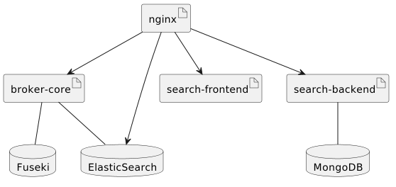
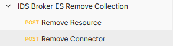

# MDS Broker Repository
This repository provides the source code for the extentions of the open-source implementation of the [MetaDataBroker](https://github.com/International-Data-Spaces-Association/metadata-broker-open-core). Its central extension is an implementation of the Indexing-Interface that provide the core functionality for the front-end as well as the relevant https-Endpoints for the front-end.

## International Data Spaces Metadata Broker (Fraunhofer IAIS/EIS implementation)

This is an implementation of an International Data Spaces (IDS) Metadata Broker, which is a registry for IDS Connector self-description documents.
It is currently under development and intends to act as a reference for members of the International Data Spaces Association (IDSA) to help with the implementation of custom Broker solutions.</br></br>
Work on this repository closely aligns with the [IDS Handshake Document](https://industrialdataspace.jiveon.com/docs/DOC-1817),
which describes the concepts of communication on the IDS in textual form.
Some more detailed introductory material on the IDS Broker general concept is available in the form of a [slide deck](documentation/general/Broker_Overview_Slides.pdf).

## Purpose

The goal of this implementation is to show how the concepts introduced in the Handshake Document can be turned into an actual application.
It, therefore, demonstrates the usage of the [IDS Information Model](https://github.com/International-Data-Spaces-Association/InformationModel) for core communication tasks.
More specifically, it shows:

* Implementation of the messaging interfaces for IDS infrastructure-level communication,
* Information flow of typical interactions with the Broker

Security is currently supported in terms of TLS via a reverse proxy.

## Architecture


The diagram above provides an overview of the IAIS/EIS Broker's architecture. The technical interface for human users and connectors is supplied
by a reverse proxy, which serves a GUI and an SSL-secured machine-invokable API. Incoming requests are either served by the web frontend or routed to a message
handler component, which, depending on the message type, accesses the backend storage systems.   

### Container Dependencies


## Building the MDS-Extention MetaDataBroker
### Buildung the Open Source MetaDataBroker
As the MetaDataBroker is an extension to the open source implementation of the MetaDataBroker, you can either build the MetaDataBroker from a particular branch of the open-source broker or query a particular artifact from the Fraunhofer IAIS Artifactory. We start with the former approach an first build the open source broker. First checkout the repository of the open core broker
```sh
git clone https://github.com/International-Data-Spaces-Association/metadata-broker-open-core.git
```
'cd' into the repository and checkout the branch or tag you want to use as a basis for the MetaDataBroker extension of the open source broker. Please have in mind, that the extension was provided with respect to a particular release of the open source broker as well as the [information model](https://github.com/International-Data-Spaces-Association/InformationModel). </br></br> Now that you have chosen your preferred branch or tag of the open source MetaDataBroker you simply build it with maven
```sh
mvn clean package
```
and install it into your repository, e.g. locally using
```sh
mvn install
```
If you do not prefer to build it locally, but in a build pipeline, you will want to push the artifact of the open source broker into an Artifactory. Please adjust the Artifactory configuration in the pom.xml of the *metadata-broker-core*, *broker-common*, *indexing-common*  and the *mds-elasticsearch-indexing-provider* modules accordingly. All of them depend on the  implementation of the open source MetaDataBroker. Under the assumption that this configuration works we proceed.

### Buildung the MDS-Extension MetaDataBroker
Now clone **this** repository and repeat the procedure above. Build the MetaDataBroker
```sh
mvn clean package
```
The resulting "metadata-broker-core-*.jar" file in the target folder of the *metadata-broker-core* module is the final artifact of the broker.
## Run the MetaDataBroker in DEBUG Mode
Before you deploy the MetaDataBroker you might want to test the core functionality like persisting and indexing locally. To do so first follow the procedure as explained in sections "Buildung the Open Source MetaDataBroker" and "Buildung the MDS-Extension MetaDataBroker". Now "cd" from the root to the docker and there to the composefiles folder. Enter DEBUG
```sh
cd ./docker/composefiles/DEBUG
```
Start the Container
```sh
docker-compose -up
```
Now open the module *metadata-broker-core* in your favorite IDE (we tested it with Intellij). And run the main in debug mode. It might be that the test fails due to the specified location of the keystore and later due to the validation of the DAPS-certification. To fix the former change the path of the keystore (*ssl.javakeystore*) in your *application.properties* to the exemplary one in the resource folder (*isstbroker-keystore.jks*). Regarding the DAPS-certificate validation: In case that you working in a local setup only and not in a critical infrastructure you can set in your *application.properties* the property *daps.validateIncoming* to *false*. Now runing it should seamlessly work.
### Manual Testing
In order to test the core use-cases of the MetaDataBroker we refer to the provided [Postman Collection](https://github.com/Mobility-Data-Space/MDS-Broker-Core/blob/development/doc/IDS%20Broker%20ES%20Tests%20with%20MDS.postman_collection.json). If you add this collection to you postman workspace you can easily validate the use cases of the broker. By default you find
* the elastic search instance under http://localhost:9200; the registered connectors and resources under http://localhost:9200/registrations and http://localhost:9200/resources/, respectively


## Deployment
The repository comes with scripts to build a default container.</br></br>
:warning: **WARNING**: The container provided is for demonstration purpose and not thought to be deployed to a critical infrastructure. The base images that are used are provided by trustful organizations
and are the "official" ones from DockerHub. However, we are aware of a few security vulnerabilities which are part of the images although they are not used by the MetaDataBroker. Therefore we recommand to deploy the MetaDataBroker based on base images that you build or at least from sources that your trust.  </br></br>

As the MetaDataBroker needs access to a Fuseki Server as well as an ElasticSearch instance, we provide a build script for a Docker image of
* the [MetaDataBroker](https://github.com/Mobility-Data-Space/MDS-Broker-Core/blob/development/docker/metadata-broker-core/Dockerfile),
* an instance of a [Fuseki-Server](https://github.com/Mobility-Data-Space/MDS-Broker-Core/blob/development/docker/fuseki/Dockerfile) as well as
* an instance of an NGINX as [reverse proxy](https://github.com/Mobility-Data-Space/MDS-Broker-Core/blob/development/docker/reverseproxy/Dockerfile).
Moreover, to demonstrate the local deployment of the MetaDataBroker setup to Docker we provide a [Docker-compose file](https://github.com/Mobility-Data-Space/MDS-Broker-Core/blob/development/docker/composefiles/localhost/docker-compose.yml).
### Building the Docker images
If you are on linux, building the Docker images is rather simple. We provide a [shell script](https://github.com/Mobility-Data-Space/MDS-Broker-Core/blob/development/docker/buildImages.sh) to build the images. We assume that you already build the MetaDataBroker as described in section "Building". Now you "cd" into the *docker* folder and run the shell script
```sh
cd ./docker
./buildimages.sh
```
If you are on Windows, you have to run the equivalent commands in you preferred command line.

## Managing DAPS certificate
### Make certificate file accessable.</br></br>
1. Adding certificate file to the docker image while building. </br> 
Dockerfile:</br>
ADD daps.crt /etc/cert/daps.crt</br>
2. Adding the certificate file via volumes</br>
The actual Implementation (broker: 5.0.2-MDS) expects the DAPS certificate file in a folder which is mounted to the path /etc/cert/ in the docker container.
docker-compose.yml-example:</br>
 broker-core:</br>
    image: registry.gitlab.cc-asp.fraunhofer.de/eis-ids/broker/core:5.0.2-MDS</br>
    volumes:</br>
      - c:/etc/cert:/etc/cert/</br>


### Add certificate to the java key store.</br></br>
The daps certificate must be added to the java key store. This goes in three ways:</br>
1. You logged in as root using the keytool command</br>
2. In the Dockerfile</br>
3. in the script (/run.sh) whats the broker proccess starts</br>
Important: Where the java key store is located depends on the docker image java installation. In our case its:
$JAVA_HOME/lib/security
</br></br>


## Maintenance
### Manual Cleaning of the Broker
To clean the Persistance module of the MetaDataBroker, two use cases are critical,
removing a particular resource from a connector and removing a particular connector. Both could be done by accessing the Fuseki server directly, e.g. via SPARQL either form the MetaDataBroker Management interface or from the Fuseki UI. However, at the same time the ElasticSearch Server has to be cleaned. This can become a mess and might lead to inconsistencies between the Fuseki and the ElasticSearch server. At the same time, the IDS [information model](https://github.com/International-Data-Spaces-Association/InformationModel) provides messages for de-registering connectors and removing resources. Both trigger the cleaning of the Fuseki and the ElasticSearch server in a consistent manner. Thus it is highly recommended to use the corresponding messages to perform manual cleaning of the data bases. </br></br>

For what follows we assume that you have a valid
* (internal) connector,
* (internal) resources identifier and
* a valid DAPS token (we will use a placeholder *<DAPS-Token>* for the DAPS token)

of the connector, respectively, the resource you want to remove. For us this is
* *https://broker.test.mobilitydataspace.io/connectors/346343534* for the connector and
* *https://broker.test.mobilitydataspace.io/connectors/346343534/-1343446310/434334386* for a resource under a connector.

To remove these objects - as mentioned earlier - we use the corresponding messages. You can send them with any application you prefer. We will explain the procedure here using [Postman](https://www.postman.com/). We prepared a  particular [collection](https://github.com/Mobility-Data-Space/MDS-Broker-Core/blob/development/doc/IDS%20Broker%20ES%20Remove%20Collection.postman_collection.json) to remove the resource and the connector. If you import the collection into postman you will see something as shown in the figure below.</br></br>
</br></br>
Both cases have in common, that you first have to set the valid DAPS token. This can be done by changing the property
*ids:tokenValue* of the *ids:securityToken* object.
```json
"ids:securityToken" : {
"@type" : "ids:DynamicAttributeToken",
"@id" : "https://w3id.org/idsa/autogen/dynamicAttributeToken/7bbbd2c1-2d75-4e3d-bd10-c52d0381cab0",
"ids:tokenValue" : "<DAPS-Token>"
}
```
We continue with removing the resource with the identifier mentioned above. The corresponding messages consists of a header only. To remove the resource, we have to set the id of the resource in the header. Namely, we have to set the property *ids:affectedResource* in the header. The result for us looks like the following
```json
"ids:affectedResource" : {
"@id" : "https://broker.test.mobilitydataspace.io/connectors/346343534/-1343446310/434334386"
}
```
If you have changed that, you can submit you request. If the identifier and the DAPS-Token are valid, the resource will be removed. To remove a connector we proceed almost similar. First we set the DAPS-token as described above. Then we set the *ids:affectedConnector* property in the header of the multipart message to the connector identifier mentioned above. The result for us looks like the following
```json
"ids:affectedResource" : {
"@id" : "https://broker.test.mobilitydataspace.io/connectors/346343534"
}
```
If you have changed that, you can submit you request. If the identifier and the DAPS-Token are valid, the connector will be removed.
### Manual Fuseki Backup
We assume that running the MetaDataBroker container in some environment (e.g. Docker),
under some *\<url\>* (e.g. localhost:3030). The manual backup can be done in a
few simple steps. Make sure that the Web-UI of the Fuseki server is available
from your machine.
* If you run the MetaDataBroker on your local machine, it is the case. Use http://*\<url\>*.
* If it is running remotely, you might do a port-forwarding to make it available
to you. For instance if it is running on a virtual machine use
```sh
ssh -L [LOCAL_IP:]LOCAL_PORT:DESTINATION:DESTINATION_PORT*.
```
We assume, that the Fuseki Web-UI is available to you.
1. Open the Web-UI
2. Go to *manage datasets*
3. Trigger a backup for the connector dataset (*/connector*) by clicking on the *backup* button
4. Access the Fuseki-server via ssh and navigate to */fuseki/backup/* (e.g. *docker exec -ti \<Container-Name\> sh*). Here you find all backups. Notice the filename of the most recent file. This is indicated by a date-time string in the filename. It should be a gz-file.
5. Copy this file via scp to a backup storage (e.g. *docker cp \<Container-Name\>:\<path in the containter to backup> <path on the local machine\>*)

Congratulations, the backup was successfully. To restore a certain backup follow
the following steps. We assume that your Fuseki-server is empty, otherwise you
should first drop the */connector* dataset (*manage datasets* -> select *remove*).
1. Open the Web-UI
2. Go to *manage datasets*
3. Navigate to *add new dataset* and add the a dataset with name *connector*
4. Go to *dataset*
5. Navigate to *upload files*, select the backup (gzip file) you want to restore
and confirm the *upload all* button.

Congratulations, the restoring an existing backup was successfully.
